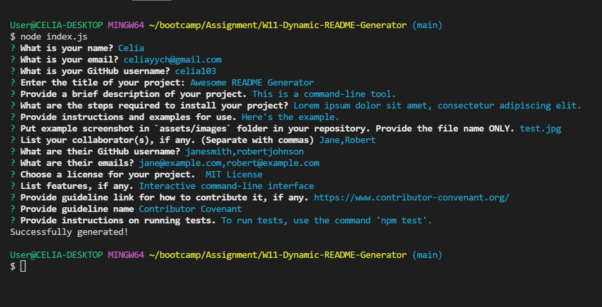

# W11-Dynamic-README-Generator

## Description

The "Dynamic README Generator" is a tool designed to simplify the creation of thorough and well-organized README files for software projects. It prompts users for essential information, such as project details, installation instructions, usage guidelines, licensing preferences, and more. The resulting README includes a table of contents for easy navigation, automatically formatted sections, and links to collaborators' GitHub profiles and emails. You can streamline and improve your project documentation by using this efficient README generation tool.

## Table of Contents

- [Installation](#installation)
- [Usage](#usage)
- [License](#license)
- [Features](#features)
- [Tests](#tests)
- [Questions](#questions)

## Installation

Follow these steps to install the Dynamic README Generator:

1. Clone the repository.
   <a href="https://github.com/celia103/W11-Dynamic-README-Generator" target="_blank">The URL of the GitHub repository</a>
2. Run 'npm install' to install dependencies.
3. Run the application using 'npm start'.
4. Follow the prompts to provide project details.

## Usage

Once installed, run the application using the command 'npm start' in the terminal. Follow the interactive prompts to input your project details. The generator will create a README file based on your responses.

For a visual walkthrough, watch it on the Google drive: <a href="https://drive.google.com/file/d/14Sn2vEiKDATYwP-RkELpf2TBitlOmRJB/view?usp=sharing" target="_blank">https://drive.google.com/file/d/14Sn2vEiKDATYwP-RkELpf2TBitlOmRJB/view?usp=sharing</a>. Or please refer to /assets/video/Walkthrough.mp4.

The walkthrough is divided into two parts:

1. **Usage Demonstration:**
   This part provides a step-by-step demonstration of how to use the application.

2. **Handling N/A Sections:**
   The second part illustrates how the application handles scenarios where some sections are marked as N/A (Not Applicable). Gain insights into the behavior when certain information is not provided.

## License

MIT License

## Features

- Automated README generation
- Interactive command-line interface
- Support for multiple licenses

## Tests

To run tests, use the command 'npm test'. Ensure that all tests pass before contributing to the project.

## Questions

If you have any questions or need further clarification, feel free to open an issue or contact directly:

- <a href="mailto:celiayych@gmail.com" target="_blank">Celia's Email</a>
